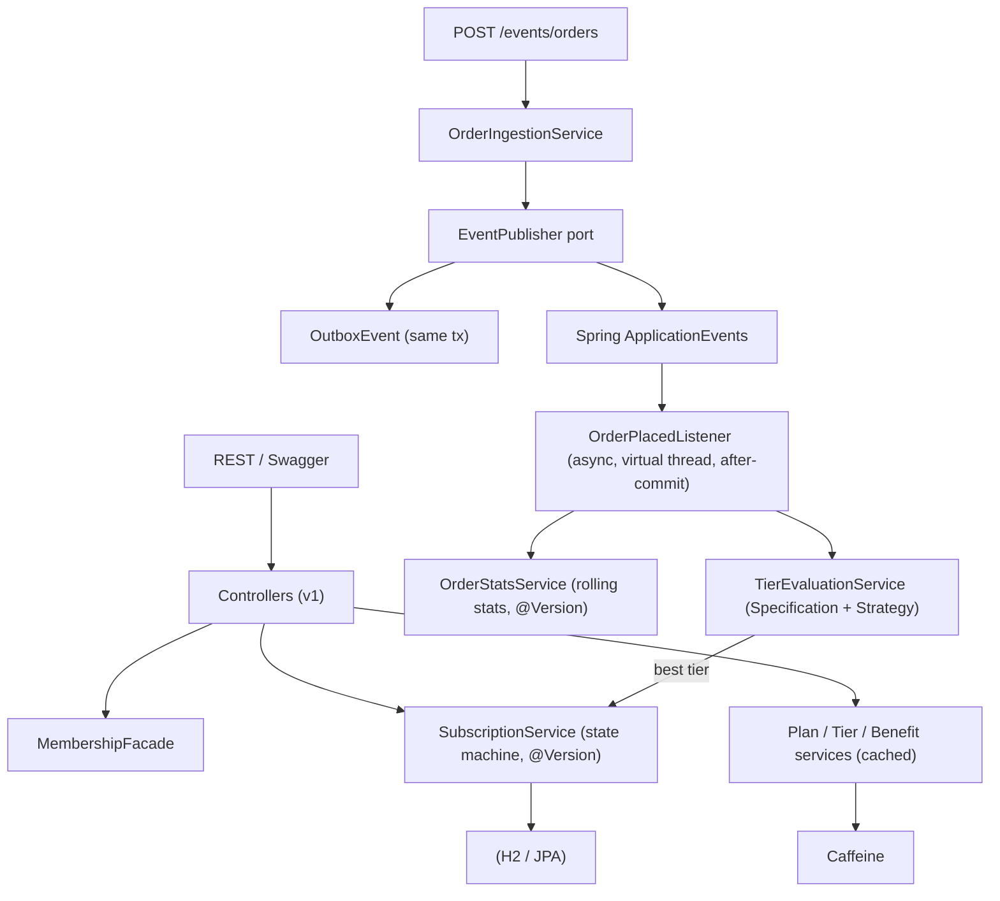

# FirstClub Membership Program with Tiers

Backend for a subscription-based membership program with tiered, configurable benefits and an
event-driven tier-progression engine. Built with **Java 21**, **Spring Boot 4**, and **Gradle**.

The app is fully self-contained: it runs with a single command using an in-memory H2 database,
a Caffeine cache, and the in-process Spring event bus. Every infrastructure concern sits behind a
port/abstraction, so Postgres, Redis, or Kafka can be dropped in without touching domain code.

---

## 1. Run it

Prerequisites: JDK 21 on the PATH. (The Gradle wrapper pins Gradle 8.14 automatically.)

```bash
./gradlew bootRun
```

Then open:

- Swagger UI: http://localhost:8080/swagger-ui
- OpenAPI JSON: http://localhost:8080/v3/api-docs
- Actuator: http://localhost:8080/actuator (health, metrics, prometheus, caches)
- H2 console: http://localhost:8080/h2-console (JDBC URL `jdbc:h2:mem:membership`, user `sa`)

A demo catalog (3 plans, 3 tiers, 5 benefit types, per-tier perks, and progression rules) is
seeded automatically on first start.

Run the tests:

```bash
./gradlew test
```

---

## 2. Demo walkthrough (copy/paste)

Browse the catalog:

```bash
curl http://localhost:8080/api/v1/plans
curl http://localhost:8080/api/v1/tiers
```

Subscribe (idempotent via the `Idempotency-Key` header):

```bash
curl -X POST http://localhost:8080/api/v1/subscriptions \
  -H "Content-Type: application/json" -H "Idempotency-Key: demo-key-1" \
  -d '{"userId":"demo-user","planId":1,"tierId":1,"autoRenew":true}'
```

Drive automatic tier progression by publishing order events (this is the stand-in for the
checkout service). Five+ orders promote the user to GOLD; fifteen+ to PLATINUM:

```bash
for i in $(seq 1 6); do
  curl -s -X POST http://localhost:8080/api/v1/events/orders \
    -H "Content-Type: application/json" \
    -d '{"userId":"demo-user","orderValue":1200}' > /dev/null
done

curl "http://localhost:8080/api/v1/members/demo-user/membership"   # -> GOLD
```

Cohort-based progression (one VIP order -> PLATINUM):

```bash
curl -X POST http://localhost:8080/api/v1/events/orders \
  -H "Content-Type: application/json" \
  -d '{"userId":"vip-user","orderValue":100,"cohort":"VIP"}'

curl "http://localhost:8080/api/v1/members/vip-user/membership"    # -> PLATINUM
```

Upgrade / downgrade / cancel, and reload caches:

```bash
curl -X PATCH http://localhost:8080/api/v1/subscriptions/1/downgrade \
  -H "Content-Type: application/json" -d '{"targetTierId":2}'
curl -X POST  http://localhost:8080/api/v1/subscriptions/1/cancel
curl -X POST  "http://localhost:8080/api/v1/admin/cache/reload-all"
```

---

## 3. API surface

| Area | Endpoint | Notes |
|------|----------|-------|
| Plans | `GET /api/v1/plans` | List active plans (Monthly/Quarterly/Yearly) |
| Tiers | `GET /api/v1/tiers`, `GET /api/v1/tiers/{id}` | Tiers + resolved benefits |
| Subscribe | `POST /api/v1/subscriptions` | `Idempotency-Key` header supported |
| Upgrade | `PATCH /api/v1/subscriptions/{id}/upgrade` | Optimistic-lock guarded |
| Downgrade | `PATCH /api/v1/subscriptions/{id}/downgrade` | Optimistic-lock guarded |
| Cancel | `POST /api/v1/subscriptions/{id}/cancel` | State-machine guarded |
| Current membership | `GET /api/v1/subscriptions?userId=` | Membership + expiry |
| Member view | `GET /api/v1/members/{userId}/membership` | Composite facade view |
| Member benefits | `GET /api/v1/members/{userId}/benefits` | Effective benefits |
| Scoped discount | `GET /api/v1/members/{userId}/discount?productId=&categoryId=` | Effective extra-discount % |
| Member deals | `GET /api/v1/members/{userId}/deals` | Exclusive deals + early access |
| Order event (demo) | `POST /api/v1/events/orders` | Drives tier evaluation |
| Admin: plans | `POST/PUT /api/v1/admin/plans` | |
| Admin: tiers | `POST /api/v1/admin/tiers` | |
| Admin: rules | `GET/POST /api/v1/admin/tier-rules` | Configurable criteria |
| Admin: benefits | `GET/POST /api/v1/admin/benefits`, `POST /api/v1/admin/tier-benefits` | Configurable perks |
| Admin: discount scope | `POST /api/v1/admin/benefit-eligibilities` | Scope a discount to product/category |
| Admin: deals | `POST /api/v1/admin/deals`, `POST /api/v1/admin/deals/{id}/tier-access` | Deals + (early) access |
| Admin: cache | `GET /api/v1/admin/cache/names`, `POST .../reload?name=`, `POST .../reload-all` | |

---

## 4. Architecture & design

Package-by-feature with a hexagonal-lite (ports & adapters) structure under
`com.firstclub.membership`:

```
plan/  tier/  benefit/  discount/  deal/  subscription/  member/  event/  cache/  observability/  common/  config/
```



### Core entities
`MembershipPlan`, `Tier`, `BenefitDefinition`, `TierBenefit` (per-tier configurable value),
`TierRule` (configurable criteria), `Member`, `UserOrderStats`, `Subscription` (`@Version` +
single-active-per-user unique key), `SubscriptionHistory`, `OutboxEvent`, `IdempotencyRecord`.

### Design patterns
- **Strategy / Specification** - `RuleCriterion` beans (`MinOrders`, `MonthlyOrderValue`, `Cohort`)
  composed by `TierEvaluationService`. Add a criterion = add a bean.
- **Chain of Responsibility** - `BenefitResolver` chain turns `TierBenefit` rows into presentation-
  ready `EffectiveBenefit`s; add a perk type = add a resolver.
- **State** - `SubscriptionStateMachine` guards lifecycle transitions.
- **Facade** - `MembershipFacade` composes member + subscription + tier + benefits.
- **Builder / Factory** - entity and event construction.
- **Ports & Adapters** - `EventPublisher` (outbox + in-process bus), `CacheManager` (Caffeine).
- **Repository** - Spring Data JPA.

### Non-functional requirements
- **Caching (Step 3)** - Caffeine over read-heavy config tables (plans, tiers, benefits, rules,
  per-tier effective benefits); evicted on writes.
- **Event-driven (Step 4)** - transactional outbox + Spring events; async after-commit listeners.
- **Monitoring & logging (Step 5)** - Actuator + Micrometer/Prometheus, a `membership.events`
  counter tagged by event type, correlation-id (`X-Correlation-Id`) MDC filter, ECS structured
  JSON logs to `logs/membership.json` plus a readable console.
- **Resilient APIs (Step 6)** - Resilience4j rate limiter + bulkhead on writes, circuit breaker on
  tier evaluation; cached reads; pagination-ready repositories; lean record DTOs.
- **High concurrency (Step 7)** - optimistic locking (`@Version`) with bounded retry on a
  REQUIRES_NEW transaction per attempt; idempotent subscribe; DB-enforced single active
  subscription; async work on virtual threads.
- **Scalability / extensibility (Step 8)** - stateless services, data-driven tiers/benefits/rules
  (new tier or perk needs no code change), feature-isolated packages.
- **Cache reload (Step 9)** - admin endpoints to evict and re-warm individual caches or all caches.

### Scoped discounts (product / category), built for extension
The "extra X% discount on selected items or categories" is modeled in a dedicated, cached
`benefit_eligibility` table rather than a single value on the tier:

- Each row scopes a tier's `EXTRA_DISCOUNT` perk to a `PRODUCT`, a `CATEGORY`, or `ALL`, with an
  optional per-scope `percentageOverride` (e.g., 20% on a SKU, 12% on a category, base otherwise).
- `DiscountResolutionService` resolves the effective percentage with **most-specific-scope-wins**
  (product > category > all). With no rows, the discount applies tier-wide at the base rate.
- Matching is a Strategy: `EligibilityMatcher` beans (`ALL`/`CATEGORY`/`PRODUCT`). Adding a new
  eligibility dimension (brand, seller, region, price-band) = one enum value + one matcher bean;
  no change to the resolver. Lookups are cached per tier-benefit (`benefitEligibilities` cache) for
  low-latency checkout calls, and evicted on writes / reloadable via the cache API.

Example (GOLD has product `SKU-IPHONE`=20% and category `ELECTRONICS`=12%):

```bash
curl "http://localhost:8080/api/v1/members/demo-user/discount?productId=SKU-IPHONE&categoryId=ELECTRONICS" # 20%
curl "http://localhost:8080/api/v1/members/demo-user/discount?productId=SKU-X&categoryId=ELECTRONICS"      # 12%
curl "http://localhost:8080/api/v1/members/demo-user/discount?productId=SKU-X&categoryId=GROCERY"          # not eligible
```

### Exclusive deals & early access to sales
Modeled with `deal` + `deal_tier_access` (cached as immutable snapshots):

- `EXCLUSIVE_DEAL` with `exclusive=true` is visible only to tiers that have an access row.
- `SALE` is public from `publicStartAt`, but a tier can be granted an earlier `accessStartAt`
  (early access); higher tiers typically get earlier times. The response flags `earlyAccess=true`
  when a member is accessing before the public start.
- `DealService.accessibleDeals(userId)` filters the cached catalog by the member's tier and the
  current time. Access config is reloadable via the cache API.

```bash
curl "http://localhost:8080/api/v1/members/demo-user/deals"   # GOLD: exclusive deal only
curl "http://localhost:8080/api/v1/members/vip-user/deals"    # PLATINUM: exclusive + sale (earlyAccess=true)
```

### Swapping in distributed infrastructure
- Cache -> replace the `CacheManager` bean in `config/CacheConfig` with a Redis cache manager.
- Events -> add a Kafka adapter implementing `EventPublisher` (or relay the outbox in `OutboxRelay`).
- Database -> point `spring.datasource` at Postgres; entities and JPA are portable.

No domain or service code changes for any of the above.
